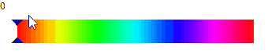

# Sliders

## ContentSlider

```XAML
<UserControl.Resources>
    <converters:EnumToBooleanConverter x:Key="EnumToBooleanConverter"/>
</UserControl.Resources>

<controls:ContentSlider Name="ContentSlider" Orientation="Horizontal"
                        Width="300" Height="30">
    <Rectangle>
        <Rectangle.Fill>
            <LinearGradientBrush EndPoint="1,0.5" StartPoint="0,0.5">
                <GradientStop Offset="0.000" Color="Red"/>
                <GradientStop Offset="0.166" Color="Yellow"/>
                <GradientStop Offset="0.333" Color="Lime"/>
                <GradientStop Offset="0.500" Color="Cyan"/>
                <GradientStop Offset="0.666" Color="Blue"/>
                <GradientStop Offset="0.833" Color="Magenta"/>
                <GradientStop Offset="1.000" Color="Red"/>
            </LinearGradientBrush>
        </Rectangle.Fill>
    </Rectangle>
</controls:ContentSlider>

<TextBlock Text="{Binding ElementName=ContentSlider, Path=Value}" HorizontalAlignment="Left" VerticalAlignment="Top"/>
```


