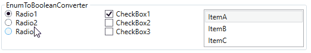
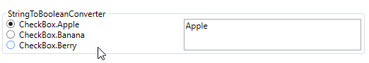
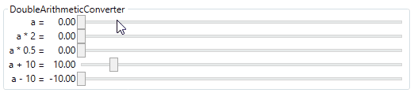

# Value Converters

## EnumToBooleanConverter

```XAML
<Window.Resources>
    <converters:EnumToBooleanConverter x:Key="EnumToBooleanConverter"/>
</Window.Resources>

<StackPanel>
    <RadioButton GroupName="Group1" Content="Radio1" IsChecked="{Binding SelectedItem, Converter={StaticResource EnumToBooleanConverter}, ConverterParameter=ItemA}"/>
    <RadioButton GroupName="Group2" Content="Radio2" IsChecked="{Binding SelectedItem, Converter={StaticResource EnumToBooleanConverter}, ConverterParameter=ItemB}"/>
    <RadioButton GroupName="Group3" Content="Radio3" IsChecked="{Binding SelectedItem, Converter={StaticResource EnumToBooleanConverter}, ConverterParameter=ItemC}"/>
</StackPanel>
<StackPanel Grid.Column="1">
    <CheckBox Content="CheckBox1" IsChecked="{Binding SelectedItem, Converter={StaticResource EnumToBooleanConverter}, ConverterParameter=ItemA}"/>
    <CheckBox Content="CheckBox2" IsChecked="{Binding SelectedItem, Converter={StaticResource EnumToBooleanConverter}, ConverterParameter=ItemB}"/>
    <CheckBox Content="CheckBox3" IsChecked="{Binding SelectedItem, Converter={StaticResource EnumToBooleanConverter}, ConverterParameter=ItemC}"/>
</StackPanel>
<ListBox Grid.Column="2" VerticalAlignment="Top" ItemsSource="{Binding Items}" SelectedItem="{Binding SelectedItem}"/>
```



## StringToBooleanConverter

```XAML
<Window.Resources>
    <converters:StringToBooleanConverter x:Key="StringToBooleanConverter"/>
</Window.Resources>

<StackPanel>
    <RadioButton GroupName="Fruit1" Content="CheckBox.Apple" IsChecked="{Binding SampleText, Converter={StaticResource StringToBooleanConverter}, ConverterParameter=Apple}"/>
    <RadioButton GroupName="Fruit2" Content="CheckBox.Banana" IsChecked="{Binding SampleText, Converter={StaticResource StringToBooleanConverter}, ConverterParameter=Banana}"/>
    <RadioButton GroupName="Fruit3" Content="CheckBox.Berry" IsChecked="{Binding SampleText, Converter={StaticResource StringToBooleanConverter}, ConverterParameter=Berry}"/>
</StackPanel>
<TextBox Grid.Column="1" Text="{Binding SampleText, UpdateSourceTrigger=PropertyChanged}"/>
```



## DoubleArithmeticConverter

```XAML
<UserControl.Resources>
    <converters:DoubleArithmeticConverter x:Key="DoubleTimesConverter" Operator="Times" DefaultOperateValue="2"/>
    <converters:DoubleArithmeticConverter x:Key="DoublePlusConverter" Operator="Plus" DefaultOperateValue="10"/>
</UserControl.Resources>

<StackPanel>
    <StackPanel.Resources>
        <Style TargetType="Slider">
            <Setter Property="Minimum" Value="0"/>
            <Setter Property="Maximum" Value="100"/>
        </Style>
    </StackPanel.Resources>
    <Slider Value="{Binding SliderValue}"/>
    <Slider Value="{Binding SliderValue, Converter={StaticResource DoubleTimesConverter}}"/>
    <Slider Value="{Binding SliderValue, Converter={StaticResource DoubleTimesConverter}, ConverterParameter=0.5}"/>
    <Slider Value="{Binding SliderValue, Converter={StaticResource DoublePlusConverter}}"/>
    <Slider Value="{Binding SliderValue, Converter={StaticResource DoublePlusConverter}, ConverterParameter=-10}"/>
</StackPanel>
```


