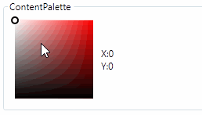
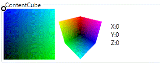

# Lils.Libs

## WPF Libs

### Value Converters

[EnumToBooleanConverter](Docs/ValueConverters.md#enumtobooleanconverter)

[StringToBooleanConverter](Docs/ValueConverters.md#StringToBooleanConverter)

[DoubleArithmeticConverter](Docs/ValueConverters.md#DoubleArithmeticConverter)

### Sliders

[ContentSlider](Docs/Sliders.md#contentslider)

[ContentPalette](Docs/Sliders.md#contentPalette)

[ContentCube](Docs/Sliders.md#contentCube)

