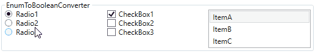

# Lils.Libs

## WPF Libs

### Value Converters

#### EnumToBooleanConverter

```XAML
<Window.Resources>
    <converters:EnumToBooleanConverter x:Key="EnumToBooleanConverter"/>
</Window.Resources>

<StackPanel>
    <RadioButton GroupName="Group1" Content="Radio1" IsChecked="{Binding SelectedItem, Converter={StaticResource EnumToBooleanConverter}, ConverterParameter=ItemA}"/>
    <RadioButton GroupName="Group2" Content="Radio2" IsChecked="{Binding SelectedItem, Converter={StaticResource EnumToBooleanConverter}, ConverterParameter=ItemB}"/>
    <RadioButton GroupName="Group3" Content="Radio3" IsChecked="{Binding SelectedItem, Converter={StaticResource EnumToBooleanConverter}, ConverterParameter=ItemC}"/>
    <RadioButton GroupName="Group4" Content="Radio4" IsChecked="{Binding SelectedItem, Converter={StaticResource EnumToBooleanConverter}, ConverterParameter=ItemD}"/>
    <RadioButton GroupName="Group5" Content="Radio5" IsChecked="{Binding SelectedItem, Converter={StaticResource EnumToBooleanConverter}, ConverterParameter=ItemE}"/>
</StackPanel>
<StackPanel Grid.Column="1">
    <CheckBox Content="CheckBox1" IsChecked="{Binding SelectedItem, Converter={StaticResource EnumToBooleanConverter}, ConverterParameter=ItemA}"/>
    <CheckBox Content="CheckBox2" IsChecked="{Binding SelectedItem, Converter={StaticResource EnumToBooleanConverter}, ConverterParameter=ItemB}"/>
    <CheckBox Content="CheckBox3" IsChecked="{Binding SelectedItem, Converter={StaticResource EnumToBooleanConverter}, ConverterParameter=ItemC}"/>
    <CheckBox Content="CheckBox4" IsChecked="{Binding SelectedItem, Converter={StaticResource EnumToBooleanConverter}, ConverterParameter=ItemD}"/>
    <CheckBox Content="CheckBox5" IsChecked="{Binding SelectedItem, Converter={StaticResource EnumToBooleanConverter}, ConverterParameter=ItemE}"/>
</StackPanel>
```



#### DoubleArithmeticConverter

```XAML
<Window.Resources>
    <converters:DoubleArithmeticConverter x:Key="DoubleTimesConverter" Operator="Times" DefaultOperateValue="2"/>
    <converters:DoubleArithmeticConverter x:Key="DoublePlusConverter" Operator="Plus" DefaultOperateValue="10"/>
</Window.Resources>

<StackPanel>
    <StackPanel.Resources>
        <Style TargetType="Slider">
            <Setter Property="Minimum" Value="0"/>
            <Setter Property="Maximum" Value="100"/>
        </Style>
    </StackPanel.Resources>
    <Slider Value="{Binding SliderValue}"/>
    <Slider Value="{Binding SliderValue, Converter={StaticResource DoubleTimesConverter}}"/>
    <Slider Value="{Binding SliderValue, Converter={StaticResource DoubleTimesConverter}, ConverterParameter=0.5}"/>
    <Slider Value="{Binding SliderValue, Converter={StaticResource DoublePlusConverter}}"/>
    <Slider Value="{Binding SliderValue, Converter={StaticResource DoublePlusConverter}, ConverterParameter=-10}"/>
</StackPanel>
```

